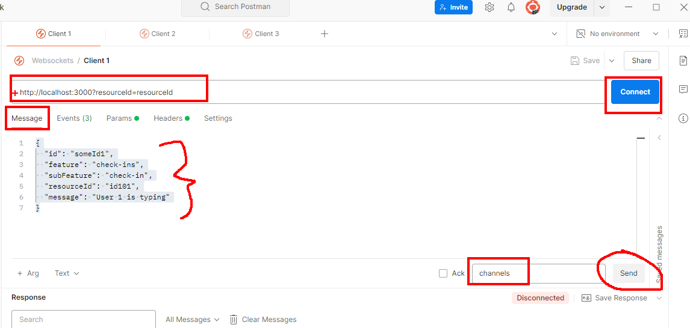
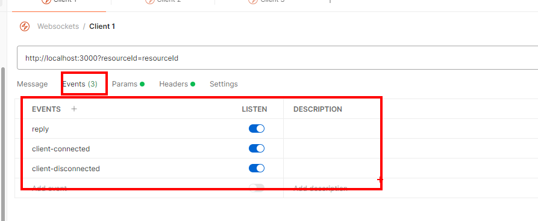

## Description
This is a simple websockets program that allows users 
to connect and send messages to everyone within the same websocket

### To test the app localy
Spin the server, then within Postman connect with `http:localhost:3000` by creating a new SocketIO request.
Within the Message tab, for the message type (just before the Send button) type in `channels`, then for the payload pass in the following payload
```json
{
  "id": "someId1",
  "feature": "check-ins",
  "subFeature": "check-in",
  "resourceId": "id101",
  "message": "User 1 is typing"
}
```

Next on the Events tab, you need to specify which message types you are interested on listening to, within the Events tad add the following events
* reply
* client-connected
* client-disconnected

## Project setup

```bash
$ npm install
```

## Compile and run the project

```bash
# development
$ npm run start
```

```bash
# watch mode
$ npm run start:dev
```

```bash
# production mode
$ npm run start:prod
```

## Run tests

```bash
# unit tests
$ npm run test

# e2e tests
$ npm run test:e2e

# test coverage
$ npm run test:cov
```

## Dependencies
Websockets and Socket IO
```bash
  npm i --save @nestjs/websockets @nestjs/platform-socket.io  @types/socket.io
```

## Create Gateway
```bash
  nest g gateway
```

# Websockets Rooms (other websocket project)
Yes, Socket.IO automatically manages the lifecycle of rooms. When there are no more clients in a room, Socket.IO will automatically "destroy" it (remove it from memory). This happens behind the scenes without you needing to implement any cleanup logic.
Here's how it works:

When a client joins a room with client.join('someRoom'), Socket.IO adds that room to its internal tracking
When a client leaves a room with client.leave('someRoom') or disconnects, Socket.IO removes that client from the room
When the last client leaves a room, Socket.IO automatically removes the room from memory
No explicit "destroy" method is needed - rooms with no clients simply cease to exist

This behavior makes Socket.IO rooms very efficient for your use case, since:

You don't need to track which rooms exist
You don't need to implement cleanup logic
Memory usage remains efficient even with many potential resources
The same room name can be reused later if new clients become interested in that resource

This automatic lifecycle management is one of the reasons why Socket.IO rooms are well-suited for your requirement of broadcasting messages only to clients interested in a specific resourceId.
